<p align="center">
  
  <h1 align="center">Collectra</h1>
  <p align="center">
    <strong>A full-stack collection and inventory management platform for collectors who take their hobby seriously.</strong>
  </p>
  <p align="center">
    <a href="https://collectra.site">Live App</a> · 
    <a href="#features">Features</a> · 
    <a href="#tech-stack">Tech Stack</a> · 
    <a href="#architecture">Architecture</a> · 
    <a href="#getting-started">Getting Started</a>
  </p>
</p>

---

## Overview

Collectra is a personal collection management web application designed to catalog, organize, track, and share physical collections of any kind — watches, playing cards, video games, electronics, or anything else worth keeping. It combines a Spring Boot REST API with an Angular single-page application, backed by PostgreSQL and AWS S3, deployed via Docker Compose on a Hetzner VPS behind Cloudflare CDN.

The project was built from scratch as a solo endeavor — every layer from database schema design and REST API architecture to Angular component development and DevOps configuration was planned, implemented, and maintained by a single developer. It serves as both a real, production-grade product with live users and a comprehensive full-stack engineering portfolio piece.

<!-- 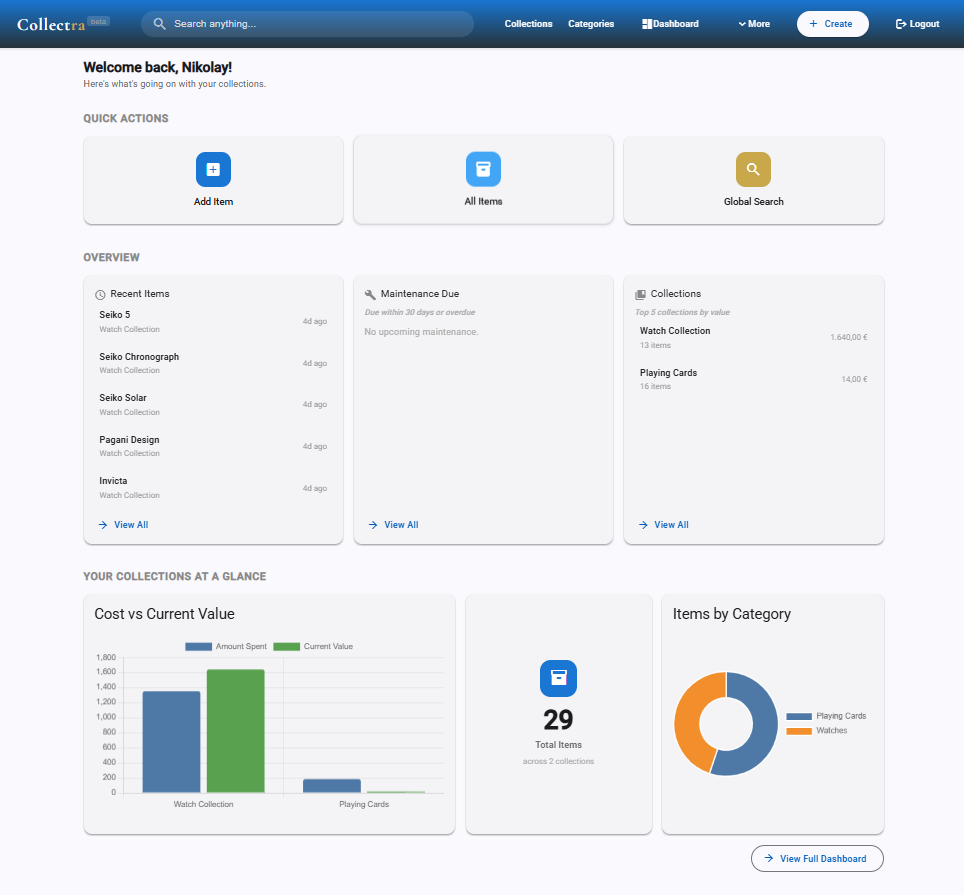 -->

---

## Table of Contents

- [Overview](#overview)
- [Tech Stack](#tech-stack)
- [Architecture](#architecture)
  - [Backend Architecture](#backend-architecture)
  - [EAV Pattern for Custom Fields](#eav-pattern-for-custom-fields)
  - [Frontend Architecture](#frontend-architecture)
  - [Infrastructure & Deployment](#infrastructure--deployment)
  - [Security Architecture](#security-architecture)
- [Features](#features)
  - [Collections](#collections)
  - [Categories & Custom Fields](#categories--custom-fields)
  - [Items](#items)
  - [Photo Management](#photo-management)
  - [Tags](#tags)
  - [Maintenance Records](#maintenance-records)
  - [Global Search](#global-search)
  - [Dashboard & Analytics](#dashboard--analytics)
  - [Collection Sharing](#collection-sharing)
  - [Data Export & GDPR Compliance](#data-export--gdpr-compliance)
  - [Authentication & Account Management](#authentication--account-management)
  - [Landing Page & Documentation](#landing-page--documentation)
- [Engineering Decisions & Problems Solved](#engineering-decisions--problems-solved)
- [Getting Started](#getting-started)
  - [Prerequisites](#prerequisites)
  - [Local Development](#local-development)
  - [Production Deployment](#production-deployment)
- [Project Structure](#project-structure)
- [Database Migrations](#database-migrations)
- [Roadmap](#roadmap)
- [License](#license)

---

## Tech Stack

### Backend
| Technology | Purpose |
|---|---|
| **Java 17** | Core language |
| **Spring Boot 3.x** | Application framework, REST API, dependency injection |
| **Spring Security** | Authentication, authorization, filter chains |
| **Spring Data JPA / Hibernate** | ORM, repository pattern, JPQL queries |
| **PostgreSQL** | Primary relational database |
| **Flyway** | Versioned database migrations |
| **Bucket4j** | Rate limiting (per-user and per-IP) |
| **Thumbnailator** | Server-side image thumbnail generation |
| **AWS S3** | Cloud photo and thumbnail storage |
| **SMTP2GO** | Transactional email delivery (password reset) |
| **JWT (jjwt)** | Stateless authentication with refresh token rotation |
| **Google API Client** | Google Sign-In ID token verification |

### Frontend
| Technology | Purpose |
|---|---|
| **Angular 17+** | SPA framework (standalone components) |
| **Angular Material** | UI component library |
| **TypeScript** | Type-safe frontend development |
| **SCSS** | Styling with variables and nesting |
| **RxJS** | Reactive programming, HTTP handling, debounced search |
| **Chart.js / ng2-charts** | Dashboard charts and visualizations |
| **Font Awesome** | Iconography |

### Infrastructure
| Technology | Purpose |
|---|---|
| **Docker / Docker Compose** | Containerization and orchestration |
| **Nginx** | Reverse proxy and static file serving |
| **Hetzner VPS** | Production server (Germany) |
| **Cloudflare** | CDN, DNS, WAF rules, email routing, DDoS protection |
| **GitHub** | Source control (monorepo) |

---

## Architecture

### Backend Architecture

The backend follows a layered architecture with strict separation of concerns:

```
Controller → Service (Interface) → Service Implementation → Repository → Database
```

Every service is defined as an interface with a corresponding implementation class. This isn't premature abstraction — it enforces a clean contract between layers, simplifies testing, and keeps the codebase consistent as it scales. Controllers are thin, delegating all business logic to the service layer.

DTOs are used at every API boundary. Entities never leak into API responses. Request validation happens via Jakarta Bean Validation annotations on DTOs, with custom exception handling through a global `@ControllerAdvice`.

All API responses follow a consistent envelope:

```json
{
  "success": true,
  "message": "Item created successfully",
  "data": { ... }
}
```

Paginated endpoints return a standardized `PageResultDTO` wrapping Spring Data's `Page` object, providing `content`, `totalElements`, `totalPages`, `currentPage`, and `pageSize` fields.

### EAV Pattern for Custom Fields

The core architectural decision that defines Collectra's flexibility is the **Entity-Attribute-Value (EAV)** pattern for custom fields. A watch collection has different attributes than a video game collection — condition grade, movement type, and case material versus platform, genre, and player count. Hardcoding these per category would make the system rigid and require code changes for every new collection type.

Instead, Collectra uses a data-driven approach:

```
Category ──< FieldDefinition ──< ItemFieldValue >── Item
```

**`FieldDefinition`** describes a custom field attached to a category. Each definition specifies the field name, display label, data type (`TEXT`, `NUMBER`, `DECIMAL`, `DATE`, `BOOLEAN`), whether it's required, validation constraints (min/max values, max length, regex patterns), a default value, and display order. Field definitions are created alongside a category and drive both backend validation and frontend form rendering.

**`ItemFieldValue`** stores the actual value for each item-field pair. The table uses typed columns (`text_value`, `number_value`, `decimal_value`, `date_value`, `boolean_value`) so that values are stored in their native types rather than as raw strings. When an item is created or updated, the service validates each submitted field value against its definition — checking type compatibility, required constraints, and value ranges — before persisting.

This architecture means:
- New categories with entirely custom schemas can be created through the UI without any code changes.
- Validation is automatic and data-driven.
- Frontend forms dynamically render inputs based on field definitions.
- The system is future-proof for new field types (dropdowns, multi-select, etc.).

A key technical consideration with EAV is the **Cartesian product problem**: joining multiple one-to-many collections in a single JPQL query can produce an exploding result set. Collectra avoids this by splitting related data into separate queries rather than attempting multi-collection `JOIN FETCH` operations.

### Frontend Architecture

The Angular frontend is built entirely with **standalone components** — no NgModules. Each feature area lives under `src/app/features/` with its own components, and shared components reside in `src/app/shared/`.

API responses are unwrapped using a centralized pattern — the service layer strips the `ApiResponse<T>` envelope and returns the inner `data` property, so components work with clean domain types.

The app uses a **dark theme with gold accents** (`var(--gold)`) as its visual identity, implemented via CSS custom properties on Angular Material components. `::ng-deep` is used judiciously for Angular Material internal styling where encapsulation prevents direct access.

Responsive design is implemented throughout with mobile-first breakpoints. The desktop navigation bar transforms into a **bottom navigation bar** on mobile screens, and layouts switch between grid and stacked views. Sticky elements use `bottom: 60px` to clear the mobile bottom nav.

### Infrastructure & Deployment

The production environment runs on a **Hetzner VPS** in Germany, orchestrated with **Docker Compose**. The stack consists of three containers:

1. **Backend** — Spring Boot JAR running in a JDK container, connected to PostgreSQL and AWS S3.
2. **Frontend** — Nginx serving the Angular production build, with reverse proxy rules forwarding `/api/*` requests to the backend container.
3. **Database** — PostgreSQL with persistent volume mounts for data durability.

Environment secrets (database credentials, JWT secret, AWS keys, SMTP credentials, Google Client ID) are injected via a `.env` file read by Docker Compose. No secrets are committed to source control.

**Cloudflare** sits in front of the VPS as a CDN and security layer:
- DNS management for `collectra.site`.
- DDoS protection on all traffic.
- WAF rate limiting rules on public endpoints (`/api/public/*`): 100 requests per 10 seconds per IP, with a 10-second block on violation.
- Cache Rule configured to bypass cache on extension-less paths (Angular routes), preventing Cloudflare from caching SPA navigation.
- `Cache-Control: max-age=86400, public` on public photo endpoints.
- **Email Routing**: `support@collectra.site` forwards inbound email to a Gmail inbox.

### Security Architecture

Authentication is **JWT-based** with **refresh token rotation**:

1. On login, the backend issues an **access token** (short-lived) and a **refresh token** (longer-lived), both stored in the browser's `localStorage`.
2. An Angular HTTP interceptor attaches the access token to every API request.
3. When an access token expires, the interceptor intercepts the 401, calls the refresh endpoint with the refresh token, receives a new token pair, and replays the original request — all transparently.
4. The refresh mechanism uses a **lock pattern** (`BehaviorSubject` with `filter` and `take`) to prevent multiple concurrent refresh requests from parallel failing API calls.
5. Refresh tokens are single-use: each refresh invalidates the old token and issues a new one (**rotation**), limiting the window of exposure for stolen tokens.

**Ownership enforcement** is applied at the service layer on every operation. All `findById`-style lookups validate that the requested resource belongs to the authenticated user. On failure, the system throws `ResourceNotFoundException` (not 403 Forbidden) to avoid leaking information about whether a resource exists for another user.

**Rate limiting** operates at two levels:
- **Authenticated endpoints**: Bucket4j with per-user token buckets, keyed by user ID extracted from the JWT.
- **Public endpoints** (shared collection views): Bucket4j with per-IP buckets, keyed by the `CF-Connecting-IP` header (injected by Cloudflare) to get the real client IP behind the CDN.
- **Cloudflare WAF**: Outer layer with rate limiting rules on `/api/public/*` as described above.

**Photo security**: Photos are never served via direct S3 URLs. All photo access is proxied through the backend regardless of context. For authenticated users, a `SecureImagePipe` on the frontend fetches internal API paths (e.g., `/api/photos/{id}/file`) with the JWT attached — the backend validates ownership and streams the bytes from S3. For shared collection views, a separate public endpoint (`/api/public/share/{token}/photo/{photoId}/file`) validates the share token and confirms the requested photo belongs to an item in the snapshot's JSONB data before streaming. No photo is ever accessible without either a valid JWT proving ownership or an active share token.

**Photo upload validation**: Files are validated for MIME type (images only), file size (10MB max), and magic byte signatures to prevent disguised file uploads. Image dimensions are also checked to reject excessively large images.

---

## Features

### Collections

Collections are the top-level organizational unit. Each collection belongs to a single user and contains items that share a common theme — "Watches", "Video Game Library", "Trading Cards", etc.

<!-- 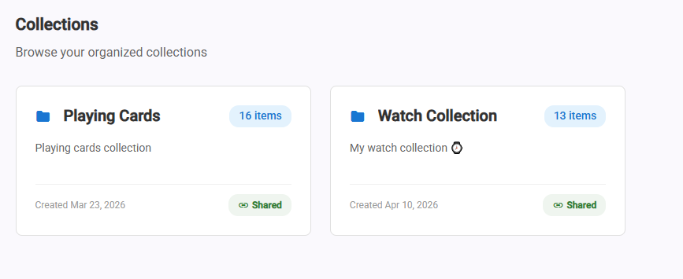 -->

- Full CRUD with name, description, and associated category.
- Collections are displayed as card grids on the home page and within the dedicated collections list.
- Item counts are displayed on each collection card.
- Financial fields: `shareFinancialInfo` flag controls whether purchase price and current value are included when the collection is shared publicly.
- Collections can be created from the home page quick action cards or the navigation bar.

### Categories & Custom Fields

Categories define the schema for items within a collection. While a collection is "what you're collecting," a category is "what kind of thing it is" and determines which custom fields are available.

<!-- 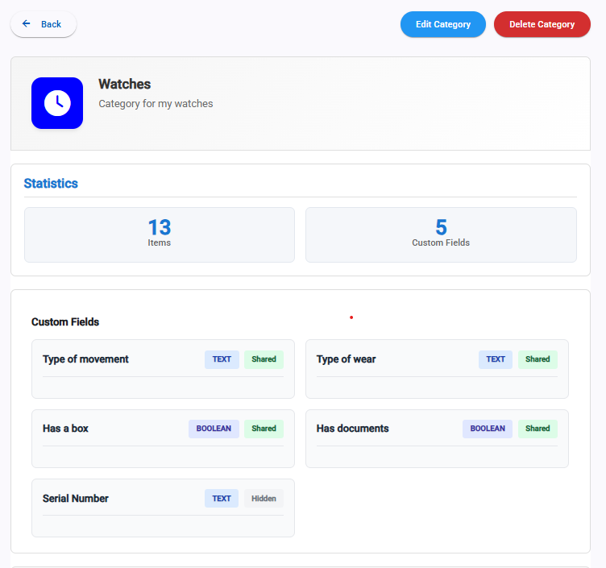 -->

- Each category has a name, description, optional icon (displayed throughout the UI), and optional color.
- **Custom Field Definitions** (the EAV system): Each category can have any number of field definitions, configured at category creation or edit time. Supported field types include text, number, decimal, date, and boolean, each with optional validation constraints.
- Display order controls the sequence of fields on item forms and detail pages.
- A `sharedPublicly` flag on categories controls whether the category's field definitions and values appear in shared collection views. This gives users granular privacy control — they might share their watch collection but hide the custom field for "Storage Location" or "Insurance Policy Number."
- Categories with an icon display it throughout the app (search results, item detail headers, category lists). Categories without an icon show a styled first-letter avatar.
- Item counts per category are displayed in the category list.

### Items

Items are the individual objects being cataloged. Each item belongs to a collection, inherits its category's custom fields, and supports rich metadata.

<!-- 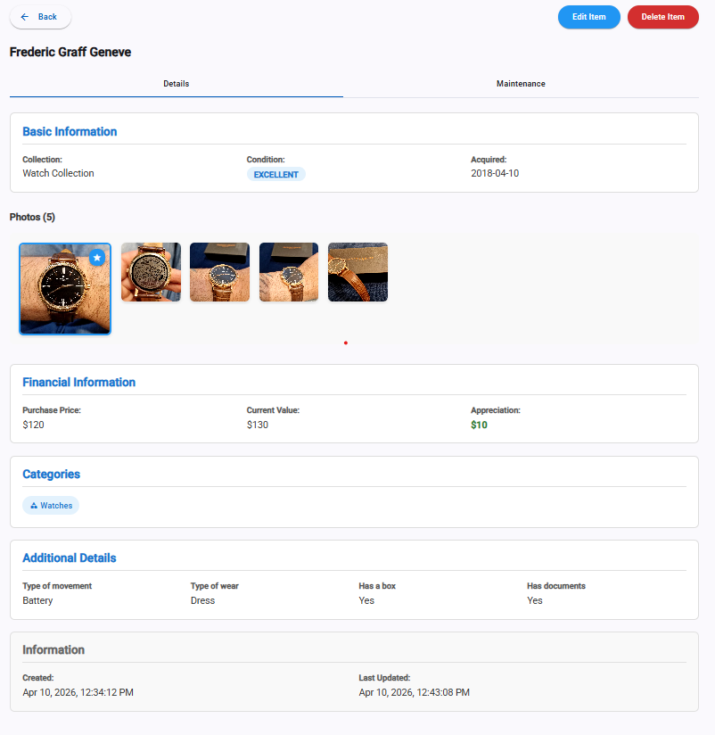 -->

- Core fields: name (required), description, condition (enum), acquisition date, purchase price, current value, notes.
- **Dynamic custom fields**: The item form renders input fields based on the category's field definitions — text inputs, number fields, date pickers, and boolean toggles, each with the appropriate validation.
- Multi-category assignment: Items can belong to multiple categories.
- Single-collection assignment: Each item belongs to exactly one collection.
- Item cards display a primary photo thumbnail (120×120), name, collection, and category.
- Item detail pages include tabbed sections for general info, photos, and maintenance records.
- Full CRUD with create and edit sharing the same reactive form component, differentiated by mode detection from the route.

### Photo Management

Every item supports a full photo gallery with upload, viewing, and management capabilities.

<!-- 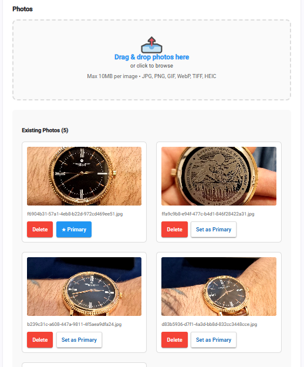 -->

- **Drag-and-drop upload**: A dropzone on the item detail page accepts dragged images or click-to-browse file selection. Uploads are sent one at a time to the backend for individual validation and processing.
- **Primary photo**: Any photo can be set as the primary image for an item. The primary photo appears as the thumbnail on item cards throughout the app.
- **Thumbnail generation**: On upload, the backend uses Thumbnailator to generate a 300×300 thumbnail (maintaining aspect ratio, 80% JPEG quality) stored alongside the original in S3 under a `thumbs/` subdirectory. The 300px size ensures crisp rendering on Retina displays even at smaller display sizes.
- **AWS S3 storage**: Photos and thumbnails are stored in S3.
- **Full-screen viewer**: Clicking any photo opens a modal gallery viewer with navigation arrows, keyboard support (← → Esc), and a photo counter.
- **Horizontal photo strip**: Item detail pages show all photos in a scrollable horizontal strip, with the primary photo displayed larger.
- **Photo deletion**: Individual delete buttons with confirmation. Deleting a photo cascades to both the original and thumbnail in S3, and decrements the user's storage usage counter.
- **Validation**: File type (image MIME types only), file size (10MB max), magic byte verification, and dimension checks.
- **Memory management**: Blob URLs created for previews are properly cleaned up with `URL.revokeObjectURL()` on component destruction.
- **Storage tracking**: Each user's total S3 storage usage (including thumbnails) is tracked via a `total_storage_bytes` column, incremented on upload and decremented on deletion.

### Tags

Tags provide cross-cutting organization that works across categories and collections. While categories define what type of item something is, tags are flexible labels for any grouping the user finds useful — "Favorites", "For Sale", "Needs Repair", "Gift Ideas".

<!-- 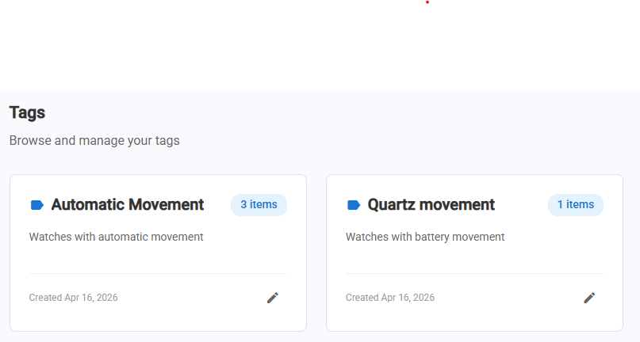 -->

- Full CRUD for tags with name and optional description.
- **Multi-select tag assignment** on the item form via a custom dropdown component built with `@HostListener` and embedded selection state (Angular CDK overlays were found to have unreliable change detection in multi-select toggle patterns, so a custom implementation proved more reliable).
- Items can be filtered by tag in the item list view.
- Tag detail pages show all items associated with that tag.
- Tag list pages display usage counts per tag.
- Tags are user-scoped — each user has their own tag namespace.

### Maintenance Records

Maintenance records track the service history, repairs, and upkeep of items. Particularly useful for watches, electronics, vehicles, and other items that require periodic maintenance.

<!-- 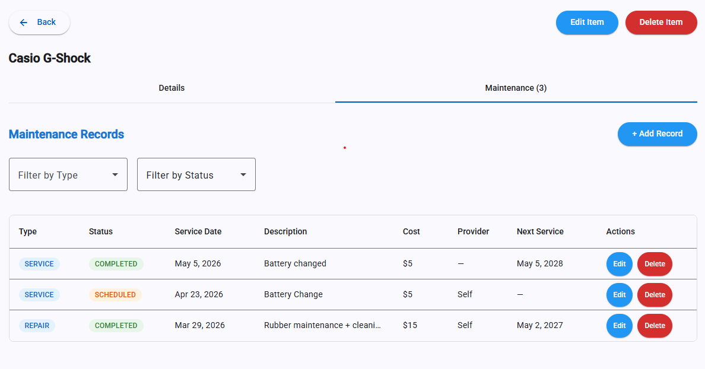 -->

- Each record is linked to an item and includes: service date, description, cost, service provider, next service date, notes, maintenance type (enum: REPAIR, CLEANING, INSPECTION, etc.), and status (enum: SCHEDULED, IN_PROGRESS, COMPLETED, CANCELLED).
- **Maintenance overview page**: A dedicated `/maintenance` route lists all maintenance records across all items, with filtering by type and status, date range filtering, sorting, and pagination.
- **Item-level tab**: Each item's detail page includes a Maintenance tab showing records for that specific item.
- **Upcoming & overdue tracking**: The home page displays a "Maintenance Due Soon" widget showing records with `nextServiceDate` within the next 30 days. Overdue records (past `nextServiceDate`, non-completed status) are highlighted.
- Status-based styling with color-coded chips (scheduled: orange, in progress: blue, completed: green, cancelled: grey).
- Full CRUD with a dedicated form page for creating and editing records.

### Global Search

Collectra provides two levels of search: a quick search in the navigation bar for fast lookups, and a full search page for detailed exploration with filtering, sorting, and pagination.

<!-- 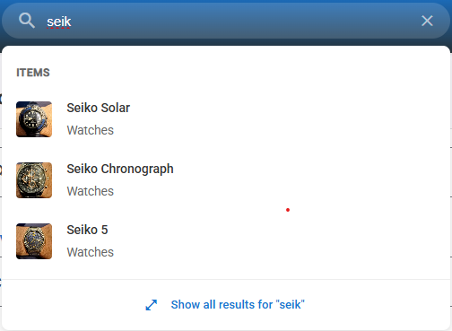 -->

**Quick Search (Navigation Bar):**
- Accessible from the navigation bar on every page.
- **Single endpoint**: `GET /api/search` returns grouped results (Collections, Categories, Items) in one response, with a configurable limit per type (e.g., top 3 of each).
- **Debounced input**: RxJS `debounceTime(300ms)` waits until the user stops typing before firing a request, combined with `distinctUntilChanged` to skip duplicate queries and `switchMap` to cancel in-flight requests when a new query arrives.
- **Minimum query length**: 2 characters before search triggers.
- **Grouped results**: Results are displayed in sections — Collections, Categories, Items — with only non-empty sections shown.
- **Visual cues in results**: Item results show their primary photo thumbnail; category results show their icon or first-letter avatar; collection results show plain text.
- **Click-to-navigate**: Each result links directly to its detail page.

<!-- 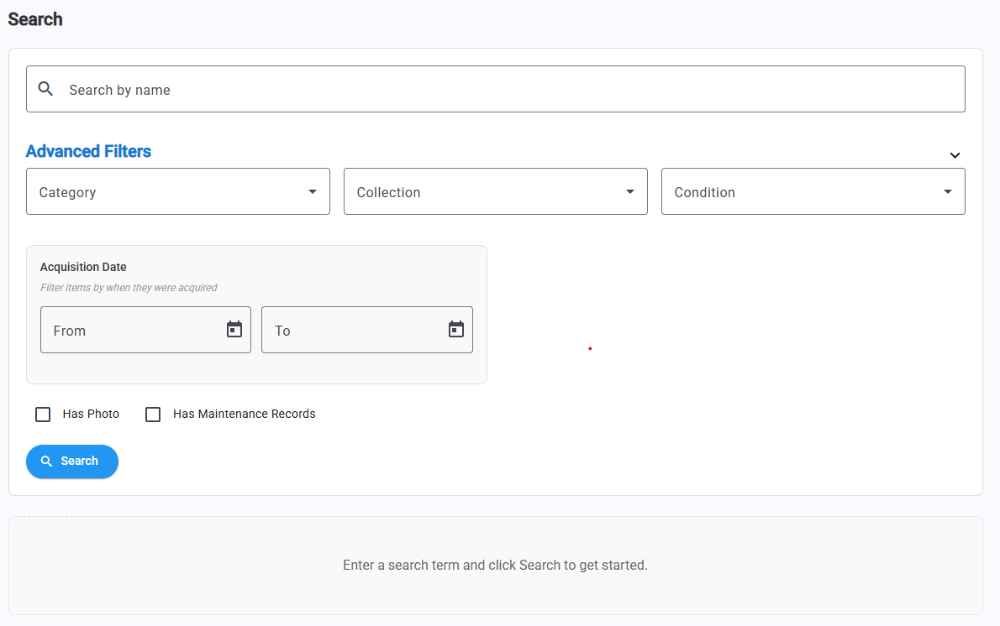 -->

**Full Search Page:**
- Dedicated search page for in-depth exploration across all entity types.
- **Server-side sorting and filtering**: The `SearchService` uses Spring Data Specifications for items (enabling complex filter combinations) and standard repository queries for other entity types.
- **Paginated results**: Supports server-side pagination with `PageResultDTO` for handling large datasets.
- Sort by name, date created, or other relevant fields in ascending or descending order.
- Filter by entity type (Items, Collections, Categories, Tags).

### Dashboard & Analytics

The dashboard provides at-a-glance insights into a user's collection portfolio through KPI cards and interactive charts, powered by Chart.js via ng2-charts.

<!-- 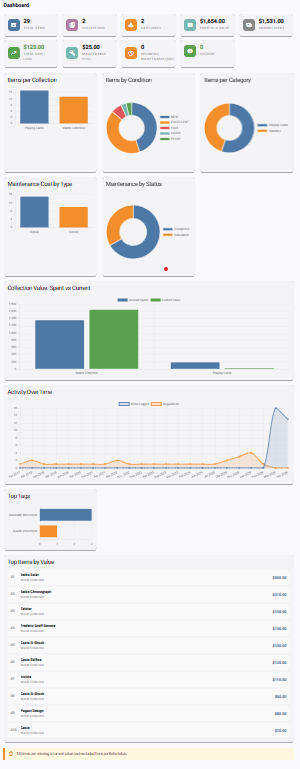 -->

**KPI Cards:**
- Total items count
- Total collections count
- Total portfolio value (sum of current values)
- Total invested (sum of purchase prices)
- Profit/loss calculation
- Total maintenance cost
- Upcoming maintenance count (next 30 days)
- Overdue maintenance count

**Charts:**
- Items per collection (bar chart)
- Items per category (doughnut chart)
- Item acquisition timeline (line chart by month)
- Category distribution (doughnut chart)
- Condition breakdown across all items (bar chart)
- Top tags by usage (horizontal bar)
- Maintenance cost by type (bar chart)
- Maintenance status breakdown (doughnut chart)

The backend serves all dashboard data via a single `GET /api/dashboard/stats` endpoint, assembled by a `DashboardService` that runs custom JPQL aggregation queries across repositories and returns a consolidated DTO. This single-request approach avoids waterfall loading in the frontend.

### Collection Sharing

Collectra allows users to share their collections publicly via revocable snapshot links. This feature was designed with privacy, security, and caching in mind.

<!-- 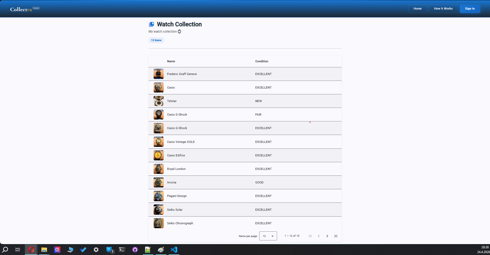 -->

**How it works:**

1. From the account settings Sharing page, the user clicks "Share" on a collection.
2. The backend serializes the current state of the collection — items, custom field values, photo references — into a **JSONB snapshot** stored in the `shared_collections` table. This is a frozen point-in-time capture, not a live view.
3. A short, unique token (base62 string via `SecureRandom`) is generated, producing clean shareable URLs like `collectra.site/share/a8Bk2mXz`.
4. The public view is accessible without authentication via a dedicated Angular route that bypasses the auth guard.

**Design decisions:**

- **Snapshot over live view**: Snapshots solve multiple problems simultaneously — cache invalidation (Cloudflare can cache aggressively since content never changes), privacy (users can delete items from their real collection without affecting the shared view), and simplicity (no complex query logic for public endpoints). If the user updates their collection and wants to re-share, they generate a new link.
- **Revocable tokens**: An `is_active` flag on the `shared_collections` record. Setting it to `false` instantly kills the link. View counts are tracked per share.
- **Granular privacy controls**: Users can choose per-category whether fields are publicly visible (`sharedPublicly` flag). A `shareFinancialInfo` flag on the collection controls whether purchase prices and current values appear. Hidden fields show as "(hidden)" in the public view with neutral styling.
- **Photo security in shared views**: Photos are served through a backend endpoint that validates the token, confirms the photo belongs to an item in the shared snapshot, and proxies the S3 response. No direct S3 access is exposed.
- **Public view UI**: Displayed as a table with item rows. Clicking an item opens a detail view with its fields and photo gallery. The public route loads a minimal component tree, not the full authenticated app shell.
- **One active share per collection**: Regenerating a link revokes the previous one and creates a fresh snapshot. This keeps the model simple — multi-link support was explicitly deferred.

### Data Export & GDPR Compliance

Collectra is GDPR-compliant, providing users with full control over their data.

<!-- 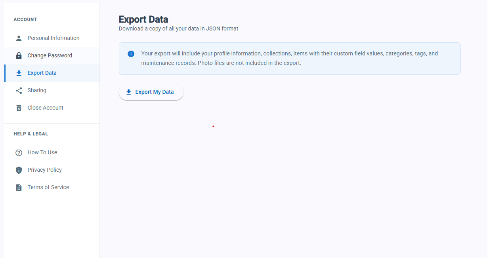 -->

**Privacy Policy**: A comprehensive privacy policy page at `/privacy` covers data collection, storage, third-party processors (AWS, Cloudflare, Google, SMTP2GO), user rights under GDPR Articles 15-21, cookie disclosure (Collectra uses no tracking cookies — only JWTs in `localStorage`), data retention periods, and contact information for the data controller. Updated to include Google Sign-In data usage disclosures.

**Terms of Service**: A dedicated `/terms-of-service` route.

**Data Export** (Article 20 — Right to Portability): `GET /api/account/export` returns a JSON file containing all of the user's data: account information, collections, items with all custom field values, categories with field definitions, tags, maintenance records, and photo metadata. The export is structured and machine-readable.

**Account Deletion** (Article 17 — Right to Erasure): `DELETE /api/account` performs a full cascade deletion: collections, items, field values, tags, maintenance records, photos (both database records and S3 objects including thumbnails), shared collection snapshots, and finally the user record. The `AccountService` orchestrates this in a transactional context, with S3 cleanup happening after the database transaction succeeds.

**Consent Tracking**: A `policy_accepted_at` timestamp is recorded on user registration. Registration is blocked without policy acceptance on both frontend and backend.

**Data Minimization**: User emails and PII are not written to application logs — user IDs are logged instead.

### Authentication & Account Management

**Local Authentication:**
- Email/password registration with BCrypt hashing.
- Email normalization (lowercased, trimmed) on all auth flows to prevent duplicate accounts.
- JWT access + refresh token pair issued on login.
- Token refresh with rotation (single-use refresh tokens).

**Google Sign-In:**
- Integration via Google Identity Services (GIS) library on the frontend, with server-side ID token verification using Google's public keys.
- Supports account linking: if a Google Sign-In email matches an existing local account, the Google ID is attached to the existing user.
- Google-only users (no password) are handled gracefully — the password column is nullable, and password-dependent flows (like "Change Password") adapt to show "Set Password" instead.
- Privacy policy updated with Google-specific data disclosures.
- OAuth consent screen submitted for Google verification (currently in test mode with manually allowlisted emails).

**Password Reset:**
- "Forgot Password" flow: user enters email → backend generates a time-limited token (stored in `password_reset_tokens` table) → sends a reset email via SMTP2GO → user clicks the link → enters a new password in a dialog.
- The endpoint always returns 200 regardless of whether the email exists, preventing email enumeration.
- Tokens are single-use and expire after a configurable time window.
- A scheduled cleanup job (`@Scheduled`) bulk-deletes expired tokens.

**Account Settings Page:**
- Sidebar navigation with sections: Personal Information, Change Password / Set Password, Export Data, Sharing, Close Account, plus Help & Legal links (How To Use, Privacy Policy, Terms of Service).
- Mobile-responsive layout with the sidebar collapsing into a horizontal scroll on smaller screens.
- `last_login` timestamp updated on actual login events; `last_active` timestamp updated during token refresh (throttled to once per 24 hours to avoid excessive DB writes).


### Landing Page & Documentation

**Landing Page** (`/`):
- A premium, dark-themed landing page with the app's signature gradient (`linear-gradient(180deg, #1976d2 0%, #263238 100%)`).
- Hero section with tagline, animated orbs, and call-to-action buttons (Sign In / Get Started).
- Feature cards highlighting: Custom Fields, Photo Gallery, Analytics & Insights, Instant Search, Maintenance Records, and Collection Sharing.
- Responsive layout with mobile-optimized typography and spacing.

**How-To Page** (`/how-to`):
- Step-by-step documentation for all major features: Collections, Categories, Items, Photos, Tags, Maintenance Records, Search, Dashboard, Sharing, and Data Export.
- Collapsible section navigation with smooth scrolling.
- Styled info callouts for tips and important notes.

**Home Page** (authenticated):
- Welcome message with user's name.
- Quick Action cards: Add Item, Create Collection, Add Maintenance.
- Data widgets: Recent Items (with relative timestamps), Maintenance Due Soon, Quick Stats.
- Mini dashboard preview with collection overview charts and a "View Full Dashboard" link.

---

## Engineering Decisions & Problems Solved

### Snapshot-Based Sharing Over Live Views
Live shared views would require solving cache invalidation with Cloudflare, handling deleted photos gracefully, and building complex public query logic. Snapshots eliminate all of these: the data is frozen as JSONB, Cloudflare can cache forever, and photo deletions from the real collection don't affect the shared view. The trade-off (stale data) is mitigated by letting users regenerate the link at any time.

### Ownership Enforcement via ResourceNotFoundException
Instead of returning 403 Forbidden when a user tries to access another user's resource, the service layer throws `ResourceNotFoundException`. This prevents information leakage — an attacker can't distinguish between "this resource exists but I don't own it" and "this resource doesn't exist." Every `findById` call chains with a user ownership check.

### Cartesian Product Prevention in JPA
Attempting to `JOIN FETCH` multiple `@OneToMany` collections (e.g., items with photos AND field values) in a single JPQL query produces a Cartesian product — the result set explodes multiplicatively. Collectra resolves this by executing separate queries for each collection and assembling the result in the service layer.

### Custom Dropdown Over Angular CDK Overlay
The tag multi-select component initially used Angular CDK's overlay module for the dropdown. However, change detection proved unreliable in multi-select toggle patterns — selections wouldn't visually update without manual `detectChanges()` calls. A custom dropdown using `@HostListener('document:click')` for outside-click detection and embedded selection state proved simpler and more reliable.

### Token Refresh Lock Pattern
When an access token expires, multiple in-flight requests fail simultaneously with 401s. Without coordination, each would trigger its own refresh call, causing race conditions and token rotation conflicts. The interceptor uses a `BehaviorSubject` as a lock: the first failing request triggers the refresh, and subsequent failures subscribe to the same subject, waiting for the result, then replaying with the new token.

### Null Sorting in Comparators
When implementing client-side sorting with nullable fields (like purchase price or acquisition date), swapping `a`/`b` parameters to reverse sort direction broke null-handling logic (nulls should always sort last). The fix was using a boolean `isAsc` flag and inverting the comparison result rather than swapping parameters, preserving the null-check structure.

### Thumbnail Strategy
Thumbnails are generated for every uploaded photo, not just the primary one. This avoids an expensive on-demand generation if the user changes the primary photo, and means the photo strip on item detail pages can use lightweight thumbnails instead of full-resolution originals. At ~20-50KB per thumbnail versus potentially several MB per original, this represents a significant bandwidth saving when loading item lists with 30+ items.

### Flyway Over Hibernate DDL Auto
`hibernate.ddl-auto=update` is fine for local development but dangerous in production — it can't handle column renames, data migrations, or rollbacks, and a bad change could destroy data. Every schema change goes through a numbered Flyway migration SQL script, versioned and tracked in a `flyway_schema_history` table. Currently at V13+.

### CSS Architecture Patterns
Several CSS patterns were adopted to solve recurring layout issues:
- `display: none` global rules must precede media queries to ensure correct specificity cascading.
- `min-width: 0` on flex and grid children prevents content overflow when children contain long text or images.
- `box-sizing: border-box` applied globally to prevent input elements from overflowing their containers when padding is added.
- Sticky elements use `bottom: 60px` on mobile to clear the bottom navigation bar.
- `::ng-deep` is used sparingly for Angular Material component internals that can't be styled through the component's view encapsulation.

---

> **📱 Mobile Version:** Collectra is fully responsive with a mobile-optimized layout including bottom navigation, stacked views, and touch-friendly controls. To preview the mobile experience, open [collectra.site](https://collectra.site) in your browser and use DevTools → Device Toolbar (F12 → Ctrl+Shift+M on Chrome) to emulate a mobile viewport or open via your phone.

All rights reserved. This repository is published for portfolio and educational purposes.

---

<p align="center">
  Built with ☕ and persistence by <strong>Nikolay Georgiev</strong>
</p>
